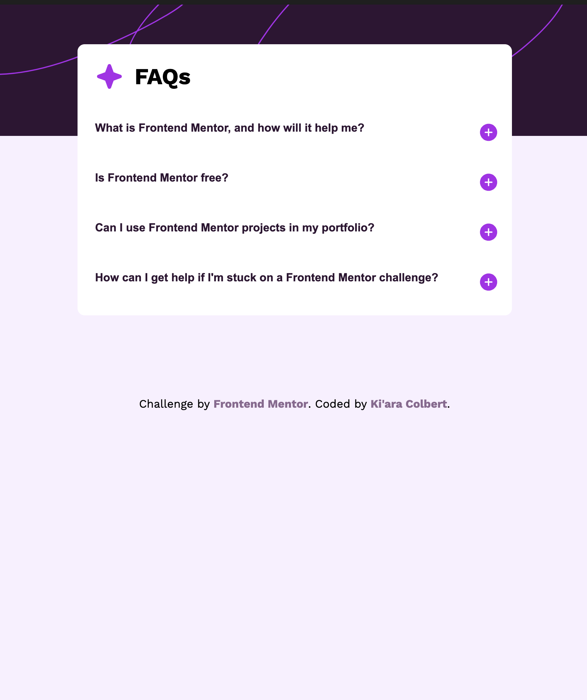

# Frontend Mentor - FAQ accordion solution

This is a solution to the [FAQ accordion challenge on Frontend Mentor](https://www.frontendmentor.io/challenges/faq-accordion-wyfFdeBwBz). Frontend Mentor challenges help you improve your coding skills by building realistic projects. 

## Table of contents

- [Overview](#overview)
  - [The challenge](#the-challenge)
  - [Screenshot](#screenshot)
  - [Links](#links)
- [My process](#my-process)
  - [Built with](#built-with)
  - [What I learned](#what-i-learned)
  - [Continued development](#continued-development)
  - [Useful resources](#useful-resources)
- [Author](#author)

**Note: Delete this note and update the table of contents based on what sections you keep.**

## Overview

### The challenge

Users should be able to:

- Hide/Show the answer to a question when the question is clicked
- Navigate the questions and hide/show answers using keyboard navigation alone
- View the optimal layout for the interface depending on their device's screen size
- See hover and focus states for all interactive elements on the page

### Screenshot

### Links

- Solution URL: [View on Frontend Mentor](https://your-solution-url.com)
- Live Site URL: [View via GitHub Pages](https://kiaraaa123.github.io/faq-accordion/)
- Repository URL: [View via GitHub](https://github.com/kiaraaa123/faq-accordion)

## My process

### Built with

- Semantic HTML5 markup
- CSS custom properties
- Flexbox
- Javascript

### What I learned

This challenge was a great way for me to gwt started with adding JavaScript into my projects. Excluding my portfolio, this project was my second solo project utilizing JavaScript. I feel as though it has helped me understand how JS concepts are used in web development.

### Continued development

I look forward to taking on more projects using JavaScript!

### Useful resources

- [How to Make an Accordion | W3Schools](https://www.w3schools.com/howto/howto_js_accordion.asp) - This resource helped me understand how JavaScript can be used to implement an accordion component.

## Author

- Website - [Ki'ara Colbert](https://www.kiaracolbert.com)
- LinkedIn - [@kiaramontgomery](https://www.linkedin.com/in/kiaramontgomery/)
- GitHub - [@kiaraaa123](https://github.com/kiaraaa123)
- Frontend Mentor - [@kiaraaa123](https://www.frontendmentor.io/profile/kiaraaa123)